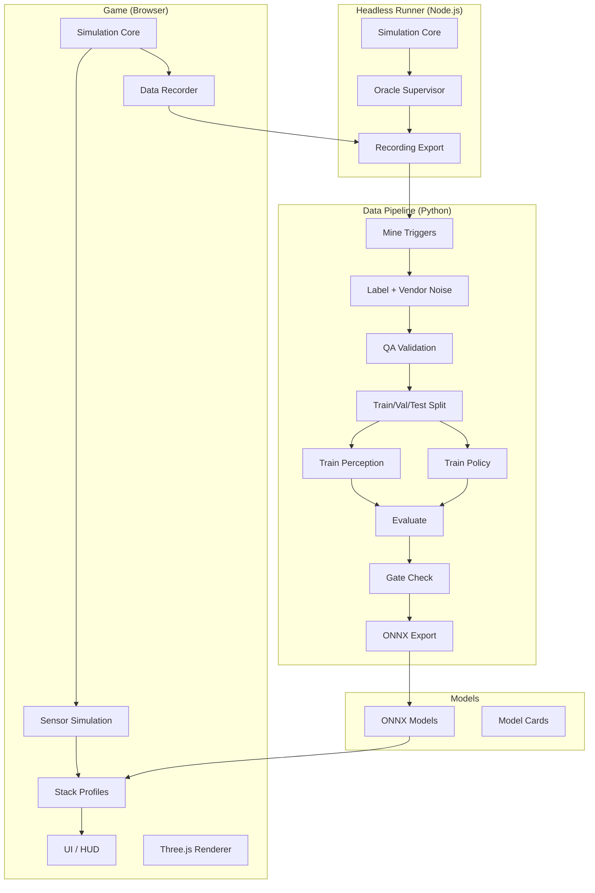

# AUTONOMY CITY: How Machines See

A browser-based, GTA-style 3D simulation where you supervise autonomous vehicles and explore how different autonomy stacks perceive the world. The project demonstrates ML engineering concepts: data pipelines, labeling operations, training, evaluation, and gated deployment.

**Disclaimer:** Simplified educational models based on public information. Not affiliated with or endorsed by any company named.

## Features

- **Six Autonomy Stack Views (F1-F6):**
  - F1: Tesla-style Vision Only (cameras, depth inference, no HD map)
  - F2: Waymo-style Multi-sensor + HD Map (lidar fusion, geofenced)
  - F3: Waabi-style AI-first (BEV occupancy, future prediction, Sim World)
  - F4: Aurora-style FMCW Lidar Trucking (per-point velocity)
  - F5: Train (signaling, braking curves, track occupancy)
  - F6: Ship (ARPA radar, AIS, COLREGs collision avoidance)

- **Gameplay:**
  - Remote supervisor role for robotaxi rides
  - Takeover control with reason logging
  - Scenario injection (jaywalker, occluded pedestrian, cut-in)
  - Day/night and weather effects

- **Data Engine (Checkpoint A):**
  - Mining interesting frames (disengagements, perception errors, near-misses)
  - Simulated labeling vendor with noise injection
  - QA with taxonomy validation and consensus checking
  - Train/val/test splits by scenario seed
  - PointNet-style perception classifier
  - Behavior cloning policy with DAgger
  - Gated model promotion
  - ONNX export for in-browser inference

## Architecture



## FACT SHEET (Sources for Real-World Claims)

All real-world claims in this project are based on publicly described information:

- **Tesla-style:** Cameras only (Tesla states no radar or lidar is needed); FSD is described as an end-to-end neural network; does not rely on detailed pre-built HD maps.

- **Waymo-style:** The 6th-generation Waymo Driver uses 13 cameras, 4 lidars, and 6 radars; operates in mapped, geofenced service areas using detailed prior maps; multi-sensor fusion.

- **Waabi-style:** Uses lidars, cameras, and radars; describes an "AI-first", generative-AI-based stack that is "end-to-end trainable" with "intermediate interpretable representations" (not a black box); trains in Waabi World, a simulator with world reconstruction, sensor simulation, scenario generation including adversarial scenarios, and closed-loop learning; focuses on autonomous trucking.

- **Aurora-style:** Uses FirstLight, a frequency-modulated continuous-wave (FMCW) lidar; FMCW lidar measures range and per-point radial velocity (Doppler); used for long-range highway trucking in Texas.

- **Rail:** Fully driverless metros (e.g., Vancouver SkyTrain, driverless since the 1980s) run on signalling/train control with guarded platforms rather than camera perception; heavy-haul autonomous freight exists (e.g., Rio Tinto AutoHaul in Western Australia); trains cannot swerve and heavy trains can need more than a kilometre to stop.

- **Maritime:** Autonomous navigation systems (e.g., Avikus HiNAS) fuse cameras including infrared, radar/ARPA, and AIS, follow an ECDIS passage plan, and perform COLREGs-compliant collision avoidance.

## Quick Start

### Prerequisites

- Node.js 18+
- Python 3.11+
- npm or pnpm

### Installation

```bash
# Install all dependencies
make install
```

### Running the Game

```bash
# Development server
make dev

# Open http://localhost:3000
```

### Controls

| Key | Action |
|-----|--------|
| WASD | Drive (when in takeover) |
| Space | Brake |
| T | Takeover / Release control |
| C | Cycle camera mode (chase/topdown/cockpit) |
| V | Toggle AI View panel |
| G | Toggle Ground Truth overlay (green=matched, red=FN, orange=FP) |
| I | Toggle Info Card |
| R | Toggle recording |
| N | Toggle day/night |
| M | Toggle Compare mode |
| P | Pause simulation |
| 1 | Jaywalker scenario |
| 2 | Occluded pedestrian scenario |
| 3 | Vehicle cut-in scenario |
| 4 | Rain/fog weather toggle |
| 5 | Context-dependent obstacle (stalled car/crossing car/boat) |
| F1-F6 | Switch stack profile |

### Running Headless Simulation

```bash
# Generate sample data
make sample-data

# Or with custom parameters
cd game && npm run simulate -- \
  --profile baseline_lidar \
  --scenarios all \
  --seeds 1-10 \
  --seconds 120 \
  --oracle-supervisor
```

### Running the Data Pipeline

```bash
# Full loop: mine → label → qa → split → train → eval → gate → export
make loop

# Individual commands
autonomycity validate data/recordings/*
autonomycity mine --recordings-dir data/recordings --output data/mined
autonomycity train-perception --dataset data/splits --output models/perception_v1
```

### Running Tests

```bash
make test
```

## Project Structure

```
/game           Vite + TypeScript + Three.js game
  /src
    /sim        Simulation core (renderer-independent)
    /sensors    Lidar, radar, camera simulation
    /stacks     Perception and planning stacks
    /planning   Rule-based and learned planners
    /render     Three.js rendering
    /ui         HUD components
    /recorder   Data recording
    /ml         ONNX model loading
  /scripts      Headless runner

/pipeline       Python data pipeline
  /autonomycity
    /commands   CLI commands (mine, label, qa, train, etc.)
  /tests        pytest tests

/models         Model registry (ONNX + model cards)
/data           Recordings, taxonomy, datasets
/docs           Architecture diagrams, schemas
```

## Results

### Perception Model (v1)

| Class | Precision | Recall | F1 |
|-------|-----------|--------|-----|
| Car | 1.000 | 0.983 | 0.991 |
| Pedestrian | 1.000 | 0.988 | 0.994 |
| **Overall** | 0.996 | 0.990 | **0.993** |

The perception model **beats the heuristic baseline** (F1 0.993 vs 0.620).

### Policy Model (v1)

| Metric | Value |
|--------|-------|
| Acceleration MAE | 0.254 m/s² |
| Steering MAE | 0.066 |
| Action MSE | 0.108 |

### Data Engine

| Metric | Value |
|--------|-------|
| Total recordings | 9 |
| Total frames | 2,700 |
| Mined triggers | 3,450 |
| QA pass rate | 20.8% (intentional noise) |
| Gate check | PASSED |
| ONNX models | perception_v1.onnx (171 KB), policy_v1.onnx (76 KB) |

## Sim-to-Real Gap

These models are trained entirely on simulated data and would require significant additional work to transfer to real-world autonomous driving:

1. **Sensor simulation fidelity:** Real lidar, radar, and cameras have noise characteristics, artifacts, and failure modes not fully captured in this simulation.

2. **Domain shift:** Real-world scenes have vastly more variety in lighting, weather, object appearances, road markings, and traffic patterns.

3. **Edge cases:** The simulated scenarios cover only a tiny fraction of the challenging situations encountered in real driving (construction zones, emergency vehicles, unusual objects, etc.).

4. **Long-tail distribution:** Real perception systems must handle extremely rare but critical objects and situations that cannot all be pre-enumerated.

5. **Safety validation:** Real autonomous systems require extensive real-world testing, formal verification, redundant systems, and regulatory approval.

## Real Stacks vs. This Demo

This demo intentionally simplifies each autonomy approach for educational purposes:

- **Sensor models** use analytic ray casting rather than physics-based simulation
- **Perception** uses classical algorithms where real systems use deep learning
- **HD maps** are procedurally generated rather than surveyed
- **Planning** uses simple rule-based logic rather than learned or optimization-based approaches
- **Scenarios** are hand-crafted rather than mined from real driving data

## License

MIT

## Acknowledgments

Educational project demonstrating autonomous vehicle concepts. All company names are used descriptively based on publicly available information. No logos, brand colors, or copyrighted assets are used.
