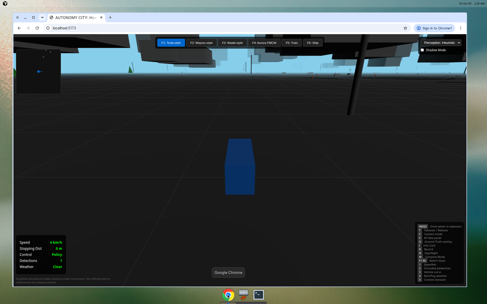
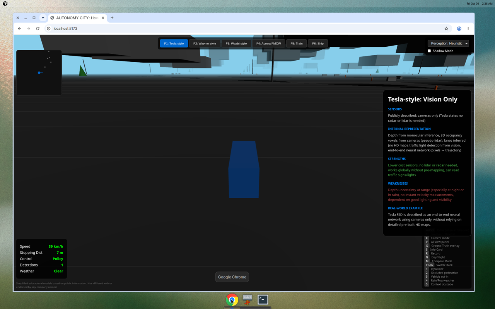
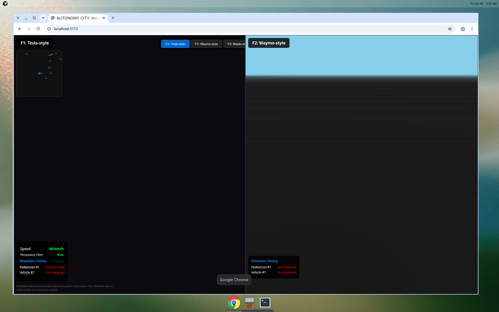
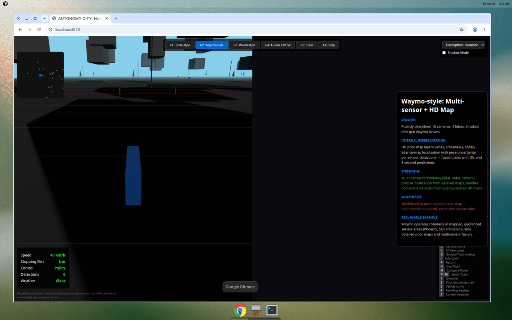
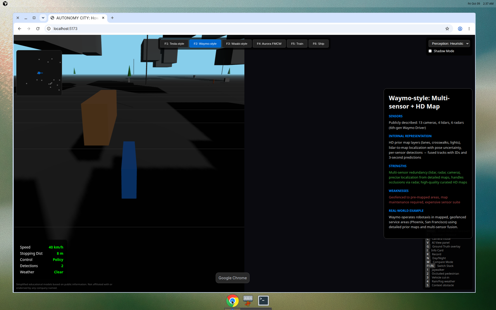

# AUTONOMY CITY Screenshots

Documentation screenshots showing the game's key features.

## Screenshots

### 1. Main Game View (Tesla-style)

3D city view with F1: Tesla-style vision-only approach selected. Shows the blue autonomous vehicle in the urban environment.

### 2. Info Card Panel

Info Card (toggled with 'I' key) showing detailed information about the Tesla-style approach:
- Sensors used
- Internal representation
- Strengths and weaknesses
- Real-world example

### 3. Compare Mode (Split Screen)

Compare Mode (toggled with 'M' key) showing split-screen view with:
- F1: Tesla-style on the left
- F2: Waymo-style on the right
- Detection timing information for both approaches

### 4. Waymo-style View

F2: Waymo-style multi-sensor approach with lidar/radar visualization and HD map integration.

### 5. Occluded Pedestrian Scenario

Scenario #2 (triggered with '2' key) demonstrating the occluded pedestrian challenge - a pedestrian about to emerge from behind an obstacle vehicle.
